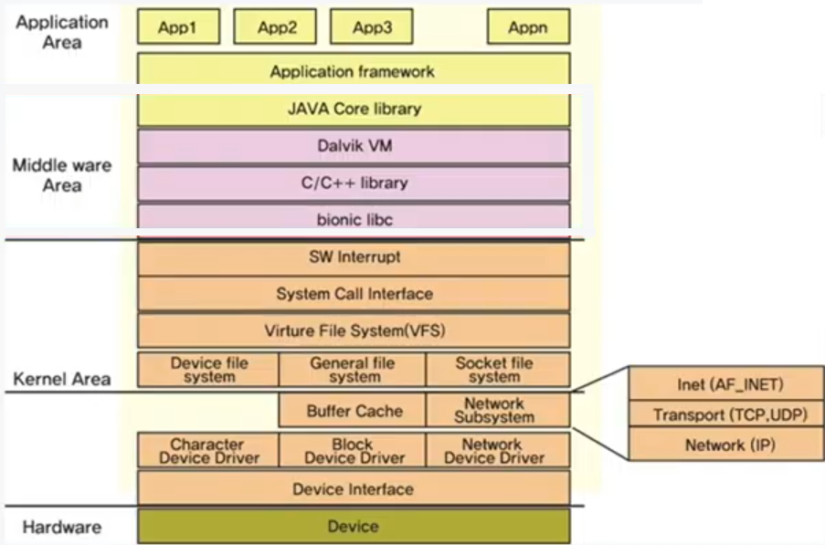

# 임베디드 에서 S/W 개발자는?

**App = Application 이란?**
- `운영체제`안에서 동작하는 프로그램을 App 이라고 한다.

임베디드 S/W 개발자를 아래와 같이 나눌 수 있다.
1. Application Level 개발자
2. Middleware Level 개발자
3. Low Level 개발자

# 1. Application Level 개발자

임베디드에서 사용되는 운영체제의 종류
1. 리눅스
2. RTOS (알티오에스)
3. 자체적으로 작은 운영체제 개발 (Firmware 라고 부름)

임베디드 S/W 개발자중 Application Level 개발자는 다음과 같은 S/W 를 만든다.

리눅스 OS 의 경우 => 리눅스 App 개발
RTOS 운영체제의 경우 => RTOS App 개발

> 임베디드 S/W의 Application Level 개발자 중 GUI 개발자도 있다.
>   - 윈도우에서 GUI App : C#, C++
>   - 리눅스에서 GUI App : C++ (Qt, GTK 라이브러리 사용)

> `App`이 제일 바깥쪽, 그 가운데에 `Shell`, 제일 안쪽에 `OS`

# 2. Middleware Level 개발자

- 운영체제의 신호를 App이 가져갈 수 있는  API
- App Level에서 운영체제에게 신호를 전달하는 API

주로 사용되는 언어
- Android 개발 홰사 : Java / C / C++
- RTOS 개발 : C

# 3. Low Level 개발자

**Firmware 개발**
- H/W 를 제어하는, 작은 운영체제를 직접 개발
- 주 언어 : C언어, Assembly
> 메모리가 고정되는 Soft하지 못한 부분도 있으므로, 'Firm'ware 라고 부른다. (Hardware는 이미 있는 이름이므로, 다른 이름을 사용)

**Device Driver 개발**
- 커널 내부에서 동작되는 프로그램으로, H/W 를 제어하는 프로그램 개발
- 주 언어 : C언어

# 임베디드 레벨 도표

이후 유튜브 라이브 보고 정리 계속 (23-03-24)

# 임베디드 S/W와 프로그래밍 언어

임베디드 S/W 개발자가 알아야 할 언어 정리

Application Level
- **1순위 : C언어** (Linux, RTOS)
- 2순위 : C#, C++ (GUI 개발시)

Middleware Level
- **1순위 : C언어**
- 2순위 : Java (for Android)

Low Level
- **1순위 : C언어**
- 2순위 : Assembly

> 임베디드 SW 개발자는 필수적으로 Assembly 를 할 줄알아야 하는가?
> - NO! 몰라도 된다. (알면 좋다.)

파이썬을 사용하는 경우:
1. 교육용 임베디드 보드 다룰 때 (라즈베리파이)
2. Linux App Level 에서, 자동 스크립트 제작할 때 (Bash 셸 스크립트 대안으로 사용)

# 임베디드 C언어 수업의 목적

임베디드 C언어라고 해서 특별한 C언어 문법이 아니다.
임베디드에서 자주 사용하는 C언어 문법을 연습하는 코스이다.

이 수업이 필요한 대상
- App, Middleware, Low Level 개발자 전부

# 배우는 내용
- C언어 파싱
- 복잡한 포인터
- 비트연산 + 구조체 + 공용체
- 여러개의 C, Header 파일 다루기
- 임베디드 코드 최적화