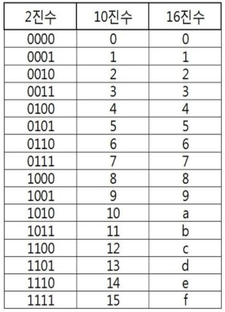

# 10진수, 2진수, 16진수

**임베디드 개발자가 진법 변환을 공부하는 이유**
  - 10진수, 2진수, 16진수를 사용해서 임베디드 개발을 해야하기 때문

## 2진수

- [숫자 0] + [b] + [2진수]
- 예시
  - 0b100010110
  - 0b1111000111

```c
int main()
{
    int a = 0b111100;

    return 0;
}
```

## 16진수

- [숫자 0] + [x] + [16진수]
- 예시
  - 0x4F10011F

```c
int main()
{
    int a = 0x4EFF10;

    return 0;
}
```
## 2진수, 16진수 외우는 팁



10진수 12는 2진수 1100,  16진수 C이다.

이걸 기준으로 외우면 편하다.

## 2진수와 16진수를 서로 변환하는 방법

**네 자리씩 끊어서 16진수로 즉시 변환 가능**
- 0b1111000011110000 = 0xF0F0

**맨 뒤에서부터 네 자리씩 끊는다.**
- 0b1110001 = 0x71

# 진수변환 최종

## 2진수 - 10진수 제곱승으로 변환

1101 = 13

0001 0101 = (16^1 * 1) + 5 = 21